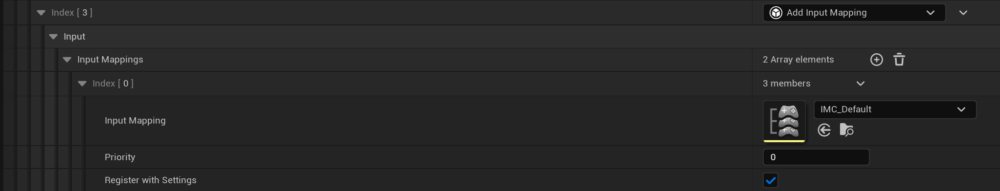
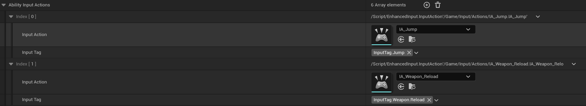

# Input

<div align="left"><figure><figcaption></figcaption></figure></div>

## 玩家输入由`HeroComponent`进行管理

* 当初始化链到达`DataAvailable`状态时，HeroComponent会调用`UKurtHeroComponent::InitializePlayerInput`完成InputAction的绑定，绑定基于以下两步：
  * 绑定InputAction与InputTag(以便于Press/Released Func索引)
  * 绑定InputAction与Press/Released Function
* 当开始处理输入时会进行如下两步：
  1. 生产者： Trigger Press Func （UKurtAbilitySystemComponent::AbilityInputTagPressed）
     * 将任务转发给`AbilitySystemComponent`，ASC会根据InputTag，索引出相应的Ability，并放入`InputPressedSpecHandles`
  2. 消费者：AKurtPlayerController::PostProcessInput（Tick执行）
     * 继续转发给`AbilitySystemComponent`，开始消费`InputPressedSpecHandles`
       * 如果Ability已经处于激活状态，InvokeReplicatedEvent(EAbilityGenericReplicatedEvent::InputPressed)
       * 否则尝试**激活能力**

## 配置Input Config

我们需要配置IMC、KurtInputConfig、KurtAbilitySet

### IMC

在`GameFeatureData`中通过`GameFeatureAction_AddInputContextMapping`进行配置
<div align="left"><figure><figcaption></figcaption></figure></div>

#### Register And Add IMC

```C++
if (UEnhancedInputLocalPlayerSubsystem* EISubsystem = 	ULocalPlayer::GetSubsystem<UEnhancedInputLocalPlayerSubsystem>(LocalPlayer))
{
	if (UEnhancedInputUserSettings* Settings = EISubsystem->GetUserSettings())
	{
		//InputMapping is a SoftObjectPtr
		if (UInputMappingContext* IMC = AssetManager.GetAsset(Entry.InputMapping))
		{
			Settings->RegisterInputMappingContext(IMC);
		}
	}
}

if (UEnhancedInputLocalPlayerSubsystem* EISubsystem = 	ULocalPlayer::GetSubsystem<UEnhancedInputLocalPlayerSubsystem>(LocalPlayer))
{
	//InputMapping has been Loaded
	if (UInputMappingContext* IMC = Entry.InputMapping.Get())
	{
		InputSystem->AddMappingContext(IMC, Entry.Priority);
	}
}
```

---

### KurtInputConfig

1. 继承Data Asset ->> KurtInputConfig，并填写相应的InputAction和InputTag

	<div align="left"><figure><figcaption></figcaption></figure></div>

2. 可通过`PawnData`或者`GameFeatureAction_AddInputBinding`配置InputConfig

### KurtAbilitySet

1. 继承Data Asset ->> KurtAbilitySet，并填写相应的Ability和InputTag
2. 可通过`PawnData`或者`GameFeatureAction_AddAbilities`配置KurtAbilitySet
